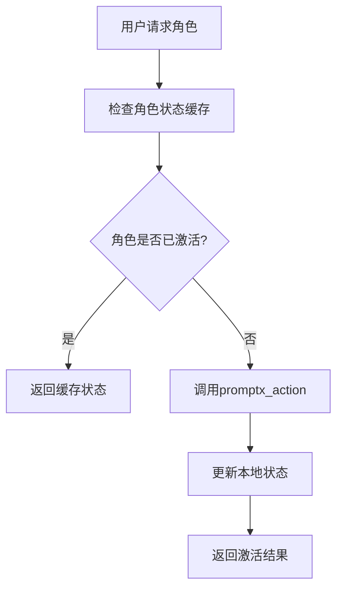
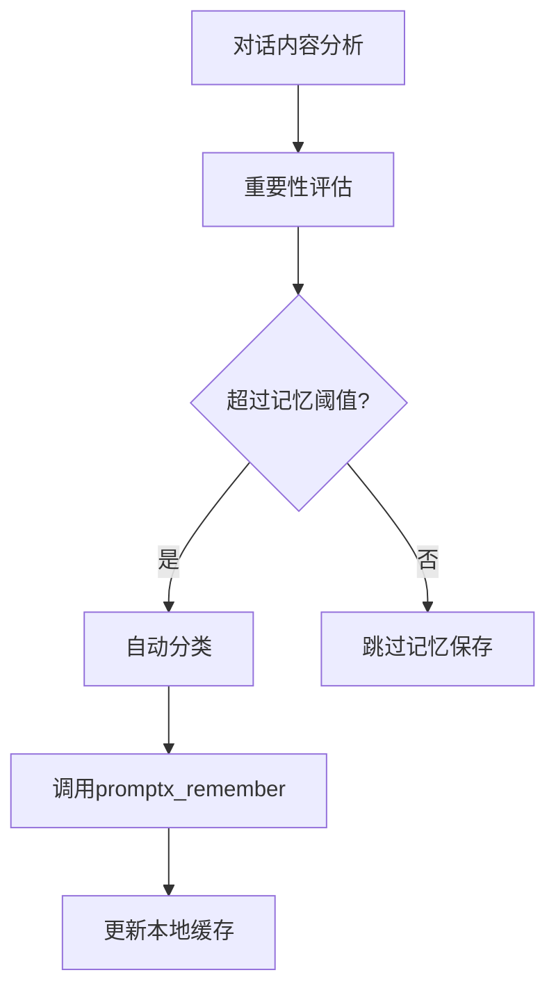

# Story 5.2: PromptX服务集成封装

## O (Objective)

### 功能目标
- 封装PromptX特有的MCP工具调用（action, remember, recall）
- 实现记忆系统的完整业务逻辑
- 提供角色激活和状态管理功能
- 建立智能记忆触发机制

### 技术目标  
- 基于MCPClient构建PromptX专用客户端
- 实现会话记忆与长期记忆的结合机制
- 提供类型安全的角色和记忆API
- 建立记忆数据的本地缓存机制

## E (Environment)

### 技术环境
- **基础依赖**: Story 5.1的MCPClient
- **PromptX工具**: promptx_action, promptx_remember, promptx_recall
- **数据存储**: 本地JSON文件缓存
- **语言**: TypeScript
- **业务逻辑**: 角色状态管理、记忆触发算法

### 依赖环境
- MCPClient已实现并测试通过
- PromptX服务器支持完整的工具集
- 文件系统写入权限（记忆缓存）

### PromptX工具规范
```typescript
// PromptX MCP工具接口
interface PromptXTools {
  promptx_action: {
    args: { role: string; context?: string }
    returns: { response: string; role_activated: boolean }
  }
  
  promptx_remember: {
    args: { content: string; importance?: number; category?: string }
    returns: { success: boolean; memory_id: string }
  }
  
  promptx_recall: {
    args: { query?: string; limit?: number; category?: string }
    returns: { memories: Memory[]; total_count: number }
  }
}
```

## S (Success Criteria)

### 及格标准 (Must Have)
- [ ] 成功激活PromptX角色（总监、架构师、规划师、写手）
- [ ] 记忆保存功能正常工作
- [ ] 记忆回忆功能返回相关内容
- [ ] 基础的错误处理和重试机制

### 优秀标准 (Should Have)  
- [ ] 智能记忆触发：根据对话内容自动保存重要信息
- [ ] 记忆分类管理：按角色和内容类型分类
- [ ] 本地缓存优化：减少重复的MCP调用
- [ ] 角色状态持久化：维护角色激活状态

### 卓越标准 (Nice to Have)
- [ ] 记忆重要性评估算法
- [ ] 跨会话的记忆连续性
- [ ] 记忆网络和关联分析
- [ ] 个性化记忆策略

## 核心实现架构

### PromptX客户端设计
```typescript
// lib/promptx/client.ts
export class PromptXClient {
  constructor(private mcpClient: MCPClient) {}

  // 角色管理
  async activateRole(role: RoleType, context?: string): Promise<RoleActivationResult> {
    return await this.mcpClient.callTool('promptx_action', { role, context });
  }

  // 记忆管理
  async saveMemory(memory: MemoryInput): Promise<MemorySaveResult> {
    const result = await this.mcpClient.callTool('promptx_remember', memory);
    await this.updateLocalCache(memory, result);
    return result;
  }

  async recallMemory(query: MemoryQuery): Promise<MemoryRecallResult> {
    const cached = await this.checkLocalCache(query);
    if (cached && !this.isCacheExpired(cached)) {
      return cached;
    }
    
    const result = await this.mcpClient.callTool('promptx_recall', query);
    await this.updateLocalCache(query, result);
    return result;
  }
}
```

### 记忆系统架构
```typescript
// lib/memory/manager.ts
export class MemoryManager {
  // 智能记忆触发
  shouldTriggerMemory(content: string, context: ConversationContext): boolean {
    // 基于关键词、对话长度、重要性评估
    return this.evaluateImportance(content) > MEMORY_THRESHOLD;
  }

  // 记忆分类
  categorizeMemory(content: string, role: RoleType): MemoryCategory {
    // 根据角色和内容类型自动分类
  }

  // 记忆检索优化
  optimizeRecallQuery(userQuery: string, context: ConversationContext): MemoryQuery {
    // 基于上下文优化检索策略
  }
}
```

## 具体任务分解

### Task 5.2.1: PromptX客户端基础封装
**时间估算**: 4小时
- 实现PromptXClient类基础结构
- 封装三个核心MCP工具调用
- 建立TypeScript类型定义
- 基础功能单元测试

### Task 5.2.2: 角色激活和状态管理
**时间估算**: 3小时
- 实现4角色的激活逻辑
- 建立角色状态持久化机制
- 处理角色切换的上下文传递
- 角色激活状态的UI数据接口

### Task 5.2.3: 记忆系统集成和优化
**时间估算**: 5小时
- 实现MemoryManager智能记忆机制
- 建立本地记忆缓存系统
- 实现记忆分类和检索优化
- 记忆触发算法和性能调优

### Task 5.2.4: 错误处理和稳定性优化
**时间估算**: 3小时
- 完善PromptX调用的错误处理
- 实现降级机制（MCP服务不可用时）
- 添加重试和超时控制
- 集成测试和稳定性验证

## 业务逻辑流程

### 角色激活流程


### 智能记忆流程


## 验证方式
1. **角色激活测试**: 验证4角色能正确激活并保持状态
2. **记忆保存测试**: 验证重要对话内容被正确保存
3. **记忆回忆测试**: 验证能根据查询回忆相关记忆
4. **性能测试**: 验证缓存机制的有效性
5. **降级测试**: MCP服务不可用时的优雅处理

## 风险和应对策略
- **风险**: PromptX服务响应慢或不稳定
  **应对**: 实现本地缓存和降级机制
- **风险**: 记忆数据量增长过快
  **应对**: 实现记忆清理和归档策略
- **风险**: 角色状态同步问题
  **应对**: 建立状态一致性检查机制