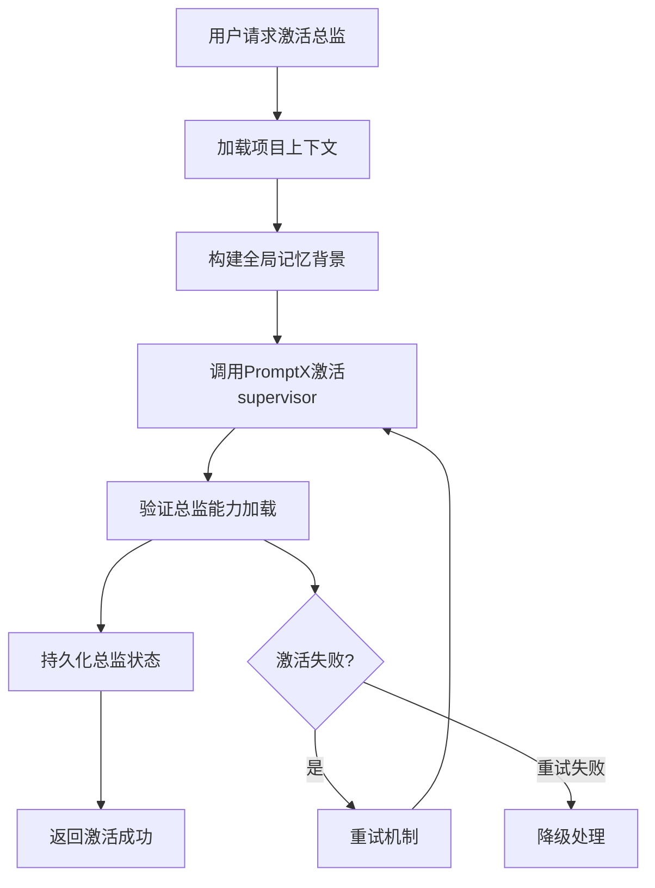
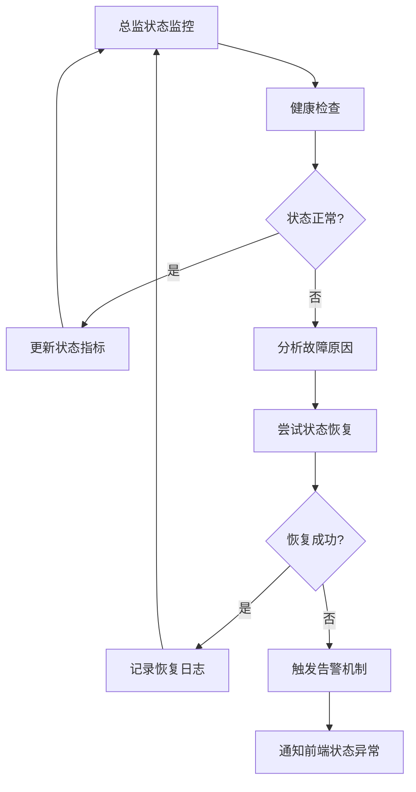

# Story 6.1: 总监角色激活和状态管理

## O (Objective)

### 功能目标
- 基于Epic 5的PromptX客户端实现总监角色的专门激活逻辑
- 建立总监角色的状态持久化和上下文管理机制
- 实现总监角色的专业特性配置和记忆关联
- 提供总监角色的健康检查和状态监控功能

### 技术目标  
- 扩展PromptXClient以支持总监角色特定功能
- 实现总监角色的上下文缓存和状态同步
- 建立总监角色的专业配置参数系统
- 提供总监角色状态的实时监控API

### 业务目标
- 确保总监角色激活后具备全局统筹能力
- 支持总监角色的跨会话状态保持
- 实现总监角色的智能上下文记忆管理

## E (Environment)

### 技术环境
- **基础依赖**: Epic 5的PromptXClient和MemoryManager
- **角色定义**: PromptX中的supervisor角色配置
- **状态存储**: Redis/内存缓存 + 文件持久化
- **语言**: TypeScript
- **框架**: Node.js + Express

### 依赖环境
- PromptX MCP服务稳定运行，supervisor角色可用
- Epic 5的记忆系统和角色管理基础架构已实现
- 用户会话管理和项目上下文系统已建立

### 总监角色特性定义
```typescript
interface SupervisorRoleConfig {
  // 角色核心能力
  capabilities: {
    globalOverview: boolean;        // 全局统筹视角
    qualityAssessment: boolean;     // 质量把控能力  
    crossArticleCoordination: boolean; // 跨文章协调
    strategicGuidance: boolean;     // 战略指导能力
  };
  
  // 记忆和上下文配置
  context: {
    memoryScope: 'global' | 'project' | 'session';
    maxContextLength: number;
    priorityTopics: string[];
  };
  
  // 专业参数配置
  parameters: {
    qualityThreshold: number;       // 质量评估阈值
    interventionTriggers: string[]; // 主动干预触发条件
    coordinationDepth: 'surface' | 'deep'; // 协调深度
  };
}
```

## S (Success Criteria)

### 及格标准 (Must Have)
- [ ] 总监角色可成功激活并保持稳定状态
- [ ] 总监角色状态在用户会话间正确持久化
- [ ] 总监角色的记忆系统与全局项目上下文关联
- [ ] 基础的总监角色配置参数生效

### 优秀标准 (Should Have)  
- [ ] 总监角色激活速度<1秒，状态切换流畅
- [ ] 总监角色的上下文记忆准确关联项目全局信息
- [ ] 总监角色状态监控提供详细的诊断信息
- [ ] 支持总监角色的个性化配置和调优

### 卓越标准 (Nice to Have)
- [ ] 总监角色的智能预热机制，基于用户习惯预加载
- [ ] 总监角色的自适应配置，根据项目特点自动调整
- [ ] 总监角色的性能分析和优化建议
- [ ] 多用户环境下的总监角色隔离和并发支持

## 核心实现架构

### 总监角色管理器
```typescript
// lib/roles/supervisor-manager.ts
export class SupervisorManager {
  constructor(
    private promptxClient: PromptXClient,
    private memoryManager: MemoryManager,
    private configManager: ConfigManager
  ) {}

  // 总监角色激活
  async activateSupervisor(context: ProjectContext): Promise<SupervisorActivationResult> {
    const config = await this.loadSupervisorConfig(context.projectId);
    const memoryContext = await this.buildGlobalContext(context);
    
    const activation = await this.promptxClient.activateRole('supervisor', {
      config,
      memoryContext,
      capabilities: this.getSupervisorCapabilities()
    });

    await this.persistSupervisorState(activation);
    return activation;
  }

  // 总监状态管理
  async maintainSupervisorState(supervisorId: string): Promise<void> {
    const healthCheck = await this.performHealthCheck(supervisorId);
    if (!healthCheck.healthy) {
      await this.recoverSupervisorState(supervisorId);
    }
    await this.updateStateMetrics(supervisorId, healthCheck);
  }

  // 全局上下文构建
  private async buildGlobalContext(context: ProjectContext): Promise<GlobalContext> {
    const projectMemories = await this.memoryManager.recallProjectMemories(context.projectId);
    const crossArticleRelations = await this.analyzeCrossArticleRelations(context);
    const qualityMetrics = await this.getProjectQualityMetrics(context);
    
    return {
      projectOverview: context.projectSummary,
      memories: projectMemories,
      relations: crossArticleRelations,
      metrics: qualityMetrics,
      timestamp: new Date()
    };
  }
}
```

### 状态持久化系统
```typescript
// lib/persistence/supervisor-state.ts
export class SupervisorStatePersistence {
  // 状态保存
  async saveSupervisorState(state: SupervisorState): Promise<void> {
    // Redis快速缓存
    await this.redis.setex(
      `supervisor:${state.sessionId}`, 
      3600, 
      JSON.stringify(state)
    );
    
    // 文件系统持久化
    await this.saveToFile(`supervisor-states/${state.supervisorId}.json`, state);
  }

  // 状态恢复
  async loadSupervisorState(supervisorId: string): Promise<SupervisorState | null> {
    // 优先从Redis读取
    const cached = await this.redis.get(`supervisor:${supervisorId}`);
    if (cached) return JSON.parse(cached);
    
    // 回退到文件系统
    return await this.loadFromFile(`supervisor-states/${supervisorId}.json`);
  }

  // 跨会话状态同步
  async syncCrossSession(supervisorId: string, newSession: string): Promise<void> {
    const historicalState = await this.loadSupervisorState(supervisorId);
    if (historicalState) {
      historicalState.sessionId = newSession;
      historicalState.lastSync = new Date();
      await this.saveSupervisorState(historicalState);
    }
  }
}
```

## 具体任务分解

### Task 6.1.1: 总监角色激活扩展
**时间估算**: 4小时
- 扩展PromptXClient以支持总监角色特定激活
- 实现总监角色的配置参数加载机制
- 建立总监角色的激活验证和错误处理
- 编写总监角色激活的单元测试

### Task 6.1.2: 总监状态管理和持久化
**时间估算**: 5小时
- 实现SupervisorStatePersistence状态持久化
- 建立Redis+文件的双重存储机制
- 实现跨会话的状态同步逻辑
- 添加状态数据的完整性检查

### Task 6.1.3: 全局上下文构建和记忆管理
**时间估算**: 4小时
- 实现总监角色的全局上下文构建
- 集成记忆系统为总监提供项目全局视角
- 建立跨文章关系分析的基础算法
- 实现总监记忆的优先级管理

### Task 6.1.4: 总监健康监控和性能优化
**时间估算**: 3小时
- 实现总监角色的健康检查机制
- 建立总监状态的实时监控指标
- 添加总监角色的自动恢复逻辑
- 性能分析和优化建议

## 业务逻辑设计

### 总监角色激活流程


### 总监状态管理流程


## 验证方式
1. **激活测试**: 验证总监角色能稳定激活并保持工作状态
2. **状态持久化测试**: 验证总监状态在会话间正确保持
3. **记忆关联测试**: 验证总监能访问和利用项目全局记忆
4. **性能压力测试**: 验证总监在高并发下的稳定性
5. **故障恢复测试**: 验证总监在异常情况下的自动恢复能力

## 配置参数示例
```json
{
  "supervisor": {
    "activation": {
      "warmupTime": 2000,
      "maxRetries": 3,
      "timeoutMs": 10000
    },
    "memory": {
      "globalContextSize": 5000,
      "priorityCategories": ["character", "plot", "worldbuilding"],
      "memoryRefreshInterval": 300000
    },
    "monitoring": {
      "healthCheckInterval": 30000,
      "stateSnapshotInterval": 60000,
      "performanceMetricsEnabled": true
    },
    "capabilities": {
      "qualityAssessmentThreshold": 0.7,
      "crossArticleAnalysisDepth": "deep",
      "interventionSensitivity": "medium"
    }
  }
}
```

## 风险和应对策略
- **风险**: 总监角色激活失败导致用户无法获得全局指导
  **应对**: 实现robust的重试和降级机制，提供基础的全局建议功能
- **风险**: 总监状态数据损坏影响持续使用
  **应对**: 多重备份机制和状态数据完整性检查
- **风险**: 总监角色内存占用过高影响系统性能
  **应对**: 实现内存管理和状态数据的定期清理机制