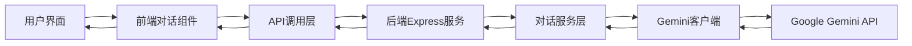

# Story 4.2: 端到端对话流程集成验证

## O (Objective)

### 功能目标
- 集成前后端对话功能，实现完整的端到端AI对话流程
- 验证前后端接口对接的正确性和稳定性
- 确保用户可以完整体验AI基础对话功能

### 技术目标
- 验证前后端API接口对接无误，数据流转正常
- 测试各种边界条件和异常情况的处理
- 优化端到端性能，确保用户体验流畅
- 建立完整的集成测试和验收流程

### 协作目标
- 协调前后端开发成果，解决集成过程中的问题
- 建立前后端协作的最佳实践和流程规范
- 为后续AI功能集成提供经验和模式参考

## E (Environment)

### 协作环境
- **前端**：React对话UI组件 + API调用逻辑
- **后端**：Express对话API + Gemini集成服务
- **集成环境**：本地开发环境 + 完整系统运行
- **测试环境**：端到端测试框架 + API测试工具

### 技术环境
- **运行环境**：Node.js后端服务 + React前端应用
- **API通信**：HTTP REST API + JSON数据交换
- **测试工具**：Postman/Insomnia + Jest/Cypress
- **调试工具**：浏览器开发者工具 + 服务器日志

### 依赖环境
- **前端组件**：Story 4.1完成的基础对话UI组件
- **后端API**：Story 4.1和4.2完成的Gemini集成服务
- **接口规范**：Story 4.1制定的API接口协议
- **外部服务**：Google Gemini API服务可用性

### 集成架构图


## S (Success Criteria)

### 及格标准 (Must Have)
- [ ] **基础对话功能**：用户可以通过前端界面发送消息，获得AI回复
- [ ] **前后端对接**：API调用成功，请求响应格式正确
- [ ] **错误处理**：网络错误、API错误等异常情况有合理提示
- [ ] **会话管理**：多轮对话上下文维护正确
- [ ] **基础性能**：单次对话响应时间在可接受范围内(< 30秒)

### 优秀标准 (Should Have)
- [ ] **用户体验流畅**：加载状态清晰，交互响应及时
- [ ] **错误恢复**：临时错误能够自动重试，网络恢复后功能正常
- [ ] **会话持久性**：刷新页面后会话历史不丢失(基于sessionId)
- [ ] **性能优化**：并发对话处理正常，无明显性能瓶颈
- [ ] **兼容性良好**：主流浏览器兼容，移动端适配正常

### 卓越标准 (Nice to Have)
- [ ] **实时体验**：支持流式响应，打字机效果
- [ ] **智能优化**：相似请求缓存，响应速度优化
- [ ] **监控数据**：API调用成功率、响应时间等指标收集
- [ ] **用户反馈**：支持用户对AI回复的反馈和评价
- [ ] **扩展性验证**：为后续4角色系统集成预留接口验证

### 协作标准
- [ ] **前后端协作顺畅**：集成过程中问题能够快速定位和解决
- [ ] **接口规范遵循**：实际实现严格遵循接口设计规范
- [ ] **数据流转正确**：端到端数据传递准确无误
- [ ] **集成测试完备**：建立完整的自动化集成测试

## 具体任务分解

### Task 4.2.1: 前后端基础集成对接 (3-4小时)
- 启动完整的前后端服务环境
- 验证前端API调用与后端接口的基础对接
- 解决跨域、路径、数据格式等基础集成问题
- 实现最简单的"发送消息-获得回复"完整流程

### Task 4.2.2: 对话功能完整性验证 (3-4小时)
- 测试单轮对话功能的完整性和正确性
- 验证多轮对话的上下文管理功能
- 测试不同消息内容和长度的处理能力
- 验证会话管理功能(创建、维护、清理)

### Task 4.2.3: 错误处理和异常场景测试 (2-3小时)
- 测试网络错误、超时等异常情况的处理
- 验证API错误(配额超限、服务不可用等)的用户提示
- 测试恶意输入、超长消息等边界条件处理
- 验证错误恢复和重试机制的有效性

### Task 4.2.4: 性能优化和用户体验改进 (2-3小时)
- 测试并发对话的系统性能表现
- 优化前端加载状态和用户交互体验
- 测试不同网络条件下的功能稳定性
- 优化API调用超时时间和重试策略

### Task 4.2.5: 集成测试和验收流程 (2小时)
- 编写端到端自动化测试用例
- 建立完整的功能验收检查清单
- 进行最终的系统集成测试和性能评估
- 生成集成测试报告和后续改进建议

## 集成测试用例

### 基础功能测试
```javascript
describe('端到端对话流程测试', () => {
  test('完整对话流程', async () => {
    // 1. 用户在前端输入消息
    const userInput = 'Hello, how are you?';
    
    // 2. 前端调用后端API
    const response = await chatAPI.sendMessage(userInput);
    
    // 3. 验证响应格式
    expect(response.success).toBe(true);
    expect(response.data.message).toBeDefined();
    expect(response.data.sessionId).toBeDefined();
    
    // 4. 验证UI更新
    expect(screen.getByText(userInput)).toBeInTheDocument();
    expect(screen.getByText(response.data.message)).toBeInTheDocument();
  });
  
  test('多轮对话上下文维护', async () => {
    // 第一轮对话
    const response1 = await chatAPI.sendMessage('My name is John');
    const sessionId = response1.data.sessionId;
    
    // 第二轮对话
    const response2 = await chatAPI.sendMessage('What is my name?', sessionId);
    
    // 验证AI能够记住上下文
    expect(response2.data.message.toLowerCase()).toContain('john');
  });
});
```

### 错误处理测试
```javascript
describe('错误处理测试', () => {
  test('网络错误处理', async () => {
    // 模拟网络错误
    jest.spyOn(global, 'fetch').mockRejectedValue(new Error('Network error'));
    
    try {
      await chatAPI.sendMessage('test message');
    } catch (error) {
      expect(error.message).toContain('网络错误');
    }
    
    // 验证UI显示错误提示
    expect(screen.getByText(/网络错误/)).toBeInTheDocument();
  });
  
  test('API错误处理', async () => {
    // 模拟API错误响应
    jest.spyOn(global, 'fetch').mockResolvedValue({
      ok: false,
      status: 500,
      json: () => Promise.resolve({
        success: false,
        error: {
          code: 'AI_SERVICE_ERROR',
          message: 'AI服务暂时不可用'
        }
      })
    });
    
    try {
      await chatAPI.sendMessage('test message');
    } catch (error) {
      expect(error.code).toBe('AI_SERVICE_ERROR');
    }
  });
});
```

### 性能测试
```javascript
describe('性能测试', () => {
  test('响应时间测试', async () => {
    const startTime = Date.now();
    
    await chatAPI.sendMessage('Simple question');
    
    const responseTime = Date.now() - startTime;
    expect(responseTime).toBeLessThan(30000); // 30秒内响应
  });
  
  test('并发请求测试', async () => {
    const promises = Array.from({ length: 5 }, (_, i) => 
      chatAPI.sendMessage(`Message ${i}`)
    );
    
    const responses = await Promise.all(promises);
    
    responses.forEach(response => {
      expect(response.success).toBe(true);
      expect(response.data.message).toBeDefined();
    });
  });
});
```

## 集成问题解决指南

### 常见集成问题及解决方案

#### 1. CORS跨域问题
```javascript
// 后端Express CORS配置
const cors = require('cors');
app.use(cors({
  origin: process.env.FRONTEND_URL || 'http://localhost:3000',
  credentials: true
}));
```

#### 2. API路径不匹配
```javascript
// 前端API调用配置
const API_BASE_URL = process.env.REACT_APP_API_URL || 'http://localhost:8000';

// 确保前后端路径一致
const response = await fetch(`${API_BASE_URL}/api/chat`, {
  method: 'POST',
  // ...
});
```

#### 3. 数据格式不一致
```typescript
// 前后端数据格式验证
interface APIResponse {
  success: boolean;
  data?: any;
  error?: {
    code: string;
    message: string;
  };
}

// 响应数据验证
const validateResponse = (response: any): APIResponse => {
  if (typeof response.success !== 'boolean') {
    throw new Error('Invalid response format');
  }
  return response;
};
```

## 部署和环境配置

### 开发环境配置
```bash
# 后端环境变量
GEMINI_API_KEY=your_api_key_here
PORT=8000
NODE_ENV=development
CORS_ORIGIN=http://localhost:3000

# 前端环境变量
REACT_APP_API_URL=http://localhost:8000
REACT_APP_ENV=development
```

### Docker集成环境
```dockerfile
# docker-compose.yml
version: '3.8'
services:
  backend:
    build: ./backend
    ports:
      - "8000:8000"
    environment:
      - GEMINI_API_KEY=${GEMINI_API_KEY}
    
  frontend:
    build: ./frontend
    ports:
      - "3000:3000"
    environment:
      - REACT_APP_API_URL=http://backend:8000
    depends_on:
      - backend
```

## 验收检查清单

### 功能验收
- [ ] 用户可以正常发送消息
- [ ] AI回复正确显示在界面上
- [ ] 多轮对话上下文维护正确
- [ ] 会话刷新后历史记录保持
- [ ] 各种错误情况有合适提示

### 性能验收
- [ ] 首次对话响应时间 < 30秒
- [ ] 后续对话响应时间 < 20秒
- [ ] 并发10个用户对话无明显延迟
- [ ] 界面交互响应及时无卡顿

### 兼容性验收
- [ ] Chrome、Firefox、Safari浏览器正常
- [ ] 移动端浏览器基本可用
- [ ] 不同屏幕尺寸适配良好

### 稳定性验收
- [ ] 连续对话30轮无异常
- [ ] 网络波动后功能恢复正常
- [ ] 长时间运行服务稳定
- [ ] 异常重启后数据不丢失

## 后续优化建议

### 短期优化 (1-2周内)
- 优化API响应时间和错误处理
- 完善前端加载状态和用户提示
- 添加基础的使用统计和监控

### 中期优化 (1个月内)
- 实现流式响应提升用户体验
- 添加对话历史的持久化存储
- 完善API限流和安全防护

### 长期规划 (2-3个月)
- 集成更多AI模型选择
- 添加对话导出和分享功能
- 建立用户反馈和质量改进机制

## 验收标准
1. **功能完整性**：端到端对话流程完全正常
2. **性能达标**：响应时间和并发性能满足要求
3. **稳定性良好**：长时间运行和异常情况处理正常
4. **用户体验优秀**：界面流畅，交互友好
5. **集成质量高**：前后端协作顺畅，代码质量良好