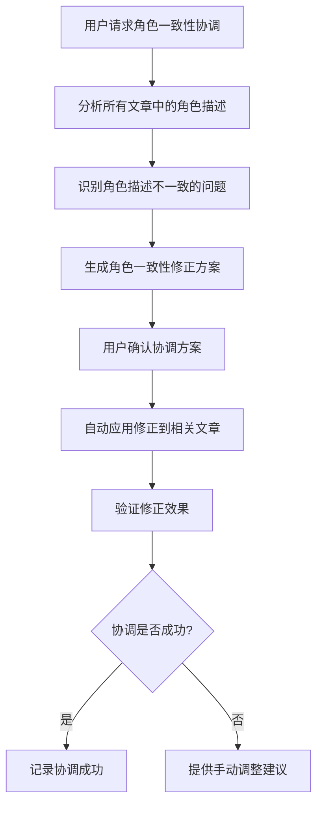
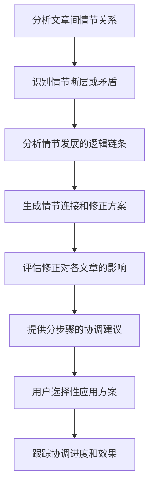

# Story 6.1: 总监跨文章协调机制设计和实现

## O (Objective)

### 功能目标
- 设计并实现总监角色的跨文章协调业务流程
- 建立文章间依赖关系的分析和管理机制
- 实现总监主导的多文章一致性检查和协调
- 提供总监跨文章问题发现和解决方案

### 协作目标
- 整合Backend的总监角色系统和质量评估引擎
- 连接Frontend的总监专属界面和项目文件管理
- 建立前后端协作的跨文章数据流转机制
- 实现端到端的跨文章协调用户体验

### 技术目标  
- 设计跨文章协调的API接口规范
- 实现文章关系图的构建和分析算法
- 建立跨文章协调的实时状态同步机制
- 提供跨文章协调结果的结构化输出

## E (Environment)

### 协作环境
- **前端**: React + 总监专属界面组件（Frontend Epic 6完成）
- **后端**: 总监角色系统 + 质量评估引擎（Backend Epic 6完成）
- **数据流**: 项目文件系统 + 跨文章关系分析
- **协作接口**: REST API + WebSocket实时协调状态

### 依赖环境
- Epic 1-3的项目文件管理和编辑系统已实现
- Epic 5的记忆系统和角色管理已稳定运行
- Backend Epic 6的总监角色激活和质量评估功能完成
- Frontend Epic 6的总监界面组件完成

### 跨文章协调场景定义
```typescript
interface CrossArticleCoordination {
  // 协调类型
  coordinationType: 
    | 'character_consistency'     // 角色一致性协调
    | 'plot_continuity'          // 情节连贯性协调
    | 'timeline_alignment'       // 时间线对齐协调
    | 'theme_coherence'          // 主题一致性协调
    | 'quality_balance';         // 质量平衡协调

  // 涉及的文章
  involvedArticles: {
    articleId: string;
    articleTitle: string;
    coordinationRole: 'source' | 'target' | 'affected';
    currentStatus: ArticleStatus;
  }[];

  // 协调问题
  issues: CoordinationIssue[];
  
  // 协调方案
  solutions: CoordinationSolution[];
}
```

## S (Success Criteria)

### 及格标准 (Must Have)
- [ ] 总监能成功识别跨文章的一致性问题
- [ ] 跨文章协调的API接口完整且稳定工作
- [ ] 前端能展示跨文章协调的问题和建议
- [ ] 基础的跨文章关系分析功能正常

### 优秀标准 (Should Have)  
- [ ] 总监能提供具体可操作的跨文章协调方案
- [ ] 跨文章协调的实时状态同步和进度追踪
- [ ] 协调方案应用后的效果验证机制
- [ ] 跨文章协调历史的记录和分析

### 协作标准 (Must Have)
- [ ] 前后端协调数据格式完全一致
- [ ] 跨文章操作的前端UI响应及时准确
- [ ] 协调过程的用户体验流畅直观
- [ ] 错误情况下的优雅降级和恢复

### 卓越标准 (Nice to Have)
- [ ] 智能的跨文章协调优先级算法
- [ ] 协调方案的影响预测和风险评估
- [ ] 跨文章协调的自动化执行能力
- [ ] 协调经验的学习和优化机制

## 核心实现架构

### 跨文章协调引擎
```typescript
// lib/coordination/cross-article-coordinator.ts
export class CrossArticleCoordinator {
  constructor(
    private supervisorManager: SupervisorManager,
    private qualityEngine: QualityAssessmentEngine,
    private fileManager: FileManager,
    private memoryManager: MemoryManager
  ) {}

  // 主要协调流程
  async coordinateArticles(projectId: string, coordinationType: CoordinationType): Promise<CoordinationResult> {
    // 1. 分析项目文章关系
    const articleRelations = await this.analyzeArticleRelations(projectId);
    
    // 2. 识别协调问题
    const issues = await this.identifyCoordinationIssues(articleRelations, coordinationType);
    
    // 3. 生成协调方案
    const solutions = await this.generateCoordinationSolutions(issues);
    
    // 4. 评估协调影响
    const impact = await this.assessCoordinationImpact(solutions);
    
    return {
      coordinationType,
      articleRelations,
      issues,
      solutions,
      impact,
      timestamp: new Date()
    };
  }

  // 文章关系分析
  private async analyzeArticleRelations(projectId: string): Promise<ArticleRelationMap> {
    const articles = await this.fileManager.getProjectArticles(projectId);
    const relations = new Map<string, ArticleRelation[]>();

    for (const article of articles) {
      const articleRelations = await this.analyzeArticleConnections(article, articles);
      relations.set(article.id, articleRelations);
    }

    return {
      articles,
      relations,
      dependencyGraph: this.buildDependencyGraph(relations)
    };
  }

  // 协调问题识别
  private async identifyCoordinationIssues(
    relations: ArticleRelationMap, 
    type: CoordinationType
  ): Promise<CoordinationIssue[]> {
    const issues: CoordinationIssue[] = [];

    switch (type) {
      case 'character_consistency':
        issues.push(...await this.checkCharacterConsistency(relations));
        break;
      case 'plot_continuity':
        issues.push(...await this.checkPlotContinuity(relations));
        break;
      case 'timeline_alignment':
        issues.push(...await this.checkTimelineAlignment(relations));
        break;
      // ... 其他协调类型
    }

    return issues.sort((a, b) => b.severity - a.severity);
  }
}
```

### 跨文章协调API设计
```typescript
// routes/coordination.ts
export class CoordinationRoutes {
  // 启动跨文章协调
  @Post('/api/coordination/analyze')
  async analyzeCoordination(req: CoordinationAnalysisRequest): Promise<CoordinationAnalysisResponse> {
    const { projectId, coordinationType, articleIds } = req.body;
    
    const coordinator = new CrossArticleCoordinator();
    const result = await coordinator.coordinateArticles(projectId, coordinationType);
    
    // WebSocket通知前端协调开始
    this.websocket.emit('coordination:started', {
      projectId,
      coordinationType,
      estimatedTime: result.estimatedTime
    });

    return {
      coordinationId: result.id,
      issues: result.issues,
      solutions: result.solutions,
      status: 'completed'
    };
  }

  // 应用协调方案
  @Post('/api/coordination/:id/apply-solution')
  async applyCoordinationSolution(req: ApplySolutionRequest): Promise<ApplySolutionResponse> {
    const { id } = req.params;
    const { solutionId, autoConfirm } = req.body;

    const solution = await this.getCoordinationSolution(id, solutionId);
    const application = await this.applySolution(solution, autoConfirm);

    // 实时更新前端状态
    this.websocket.emit('coordination:solution-applied', {
      coordinationId: id,
      solutionId,
      result: application
    });

    return application;
  }

  // 获取协调历史
  @Get('/api/coordination/history/:projectId')
  async getCoordinationHistory(req: GetHistoryRequest): Promise<CoordinationHistoryResponse> {
    const { projectId } = req.params;
    const history = await this.coordinationService.getHistory(projectId);
    
    return {
      history,
      statistics: await this.generateCoordinationStats(projectId)
    };
  }
}
```

### 前端协调界面集成
```typescript
// components/coordination/CrossArticleCoordination.tsx
interface CrossArticleCoordinationProps {
  projectId: string;
  onCoordinationComplete: (result: CoordinationResult) => void;
}

export const CrossArticleCoordination: React.FC<CrossArticleCoordinationProps> = ({
  projectId,
  onCoordinationComplete
}) => {
  const [coordinationState, setCoordinationState] = useState<CoordinationState>('idle');
  const [coordinationResult, setCoordinationResult] = useState<CoordinationResult | null>(null);

  const startCoordination = async (type: CoordinationType) => {
    setCoordinationState('analyzing');
    
    try {
      const result = await coordinationAPI.analyzeCoordination(projectId, type);
      setCoordinationResult(result);
      setCoordinationState('completed');
      onCoordinationComplete(result);
    } catch (error) {
      setCoordinationState('error');
      // 错误处理
    }
  };

  return (
    <div className="cross-article-coordination">
      {/* 协调类型选择 */}
      <CoordinationTypeSelector onSelect={startCoordination} />
      
      {/* 协调进度 */}
      {coordinationState === 'analyzing' && (
        <CoordinationProgress />
      )}
      
      {/* 协调结果展示 */}
      {coordinationResult && (
        <CoordinationResults 
          result={coordinationResult}
          onApplySolution={applySolution}
        />
      )}
    </div>
  );
};
```

## 具体任务分解

### Task 6.1.1: 跨文章协调API接口设计
**时间估算**: 4小时
- 设计跨文章协调的REST API接口规范
- 定义协调请求和响应的数据格式
- 建立WebSocket实时状态同步协议
- 编写API接口文档和示例

### Task 6.1.2: 文章关系分析算法实现
**时间估算**: 6小时
- 实现文章依赖关系的自动分析算法
- 建立角色、情节、时间线的跨文章映射
- 实现文章关系图的构建和可视化数据
- 添加关系分析的性能优化

### Task 6.1.3: 协调问题识别和方案生成
**时间估算**: 5小时
- 实现各类协调问题的识别算法
- 建立协调方案的生成和评估机制
- 实现协调方案的优先级排序
- 添加协调方案的可行性验证

### Task 6.1.4: 前端协调界面集成
**时间估算**: 4小时
- 实现跨文章协调的前端交互界面
- 集成总监专属界面的协调功能
- 实现协调进度的实时显示和更新
- 添加协调结果的可视化展示

### Task 6.1.5: 协调方案应用和效果验证
**时间估算**: 4小时
- 实现协调方案的自动应用机制
- 建立协调效果的验证和回滚功能
- 实现协调历史的记录和分析
- 添加协调性能的监控和优化

## 跨文章协调业务流程

### 角色一致性协调流程


### 情节连贯性协调流程


## 协调方案类型定义

### 自动协调方案
```typescript
interface AutoCoordinationSolution {
  type: 'auto';
  title: string;
  description: string;
  affectedFiles: string[];
  changes: FileChange[];
  confidence: number;
  estimatedTime: number;
  reversible: boolean;
}

const characterNameConsistencyFix: AutoCoordinationSolution = {
  type: 'auto',
  title: '统一角色姓名表述',
  description: '将"小明"和"明明"统一为"小明"',
  affectedFiles: ['article2.md', 'article3.md'],
  changes: [
    { file: 'article2.md', line: 15, from: '明明说道', to: '小明说道' }
  ],
  confidence: 0.95,
  estimatedTime: 1000,
  reversible: true
};
```

### 手动协调方案
```typescript
interface ManualCoordinationSolution {
  type: 'manual';
  title: string;
  description: string;
  steps: CoordinationStep[];
  priority: 'high' | 'medium' | 'low';
  category: string;
}

const plotTimelineAlignment: ManualCoordinationSolution = {
  type: 'manual',
  title: '调整情节时间线',
  description: '第二篇和第三篇的时间设定需要重新对齐',
  steps: [
    {
      step: 1,
      description: '检查第二篇中提到的季节设定',
      targetFile: 'article2.md',
      targetSection: '环境描述'
    },
    {
      step: 2,
      description: '修改第三篇开头的时间引用',
      targetFile: 'article3.md',
      targetSection: '开场设定'
    }
  ],
  priority: 'medium',
  category: 'timeline'
};
```

## 验证方式
1. **协调算法测试**: 验证各类协调问题识别的准确性
2. **API接口测试**: 验证前后端协调数据的一致性
3. **用户体验测试**: 验证协调流程的直观性和可用性
4. **性能压力测试**: 验证大量文章的协调处理能力
5. **端到端集成测试**: 验证完整的协调业务流程
6. **协调效果验证**: 验证协调方案应用后的实际效果

## 风险和应对策略
- **风险**: 跨文章协调算法复杂度过高影响性能
  **应对**: 实现分步骤处理和缓存机制，支持后台处理
- **风险**: 协调方案的自动应用可能误改用户内容
  **应对**: 建立严格的备份和回滚机制，重要修改需用户确认
- **风险**: 复杂项目的协调问题识别不准确
  **应对**: 提供协调算法的可调节参数和人工校正机制
- **风险**: 前端协调界面信息过载影响用户决策
  **应对**: 实现分层展示和渐进式信息披露