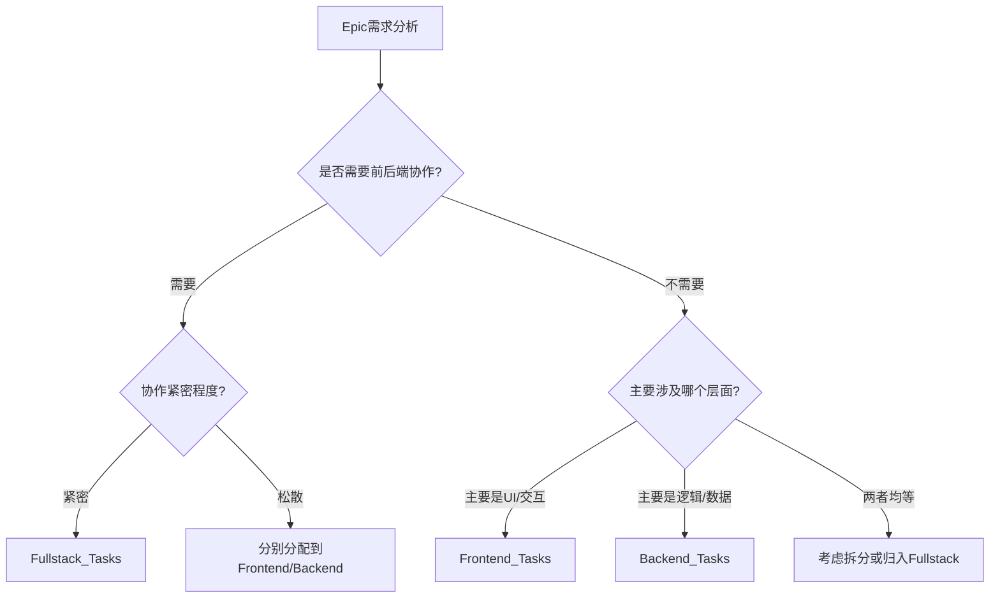

# Epic拆解方法论 - 分层分工协作模式

## 📖 方法论概述

本方法论基于对成功项目（ai-pub）的深入分析，结合现代软件开发最佳实践，提出了一套**分层分工协作**的Epic拆解模式，旨在提高开发效率、明确职责边界、优化协作流程。

## 🏗️ 核心理念

### 1️⃣ **分层分工原则**
- **按技术栈分工**：前端、后端、全栈各司其职
- **按职责边界分工**：避免跨领域职责混淆
- **按协作需求分工**：独立开发 vs 紧密配合

### 2️⃣ **技术细节平衡原则**
- **核心架构详细化**：提供明确技术指导
- **业务逻辑抽象化**：保留实现灵活性
- **接口规范标准化**：确保协作顺畅

### 3️⃣ **任务文档定位原则**
- **指导性**而非实现性文档
- **参考示例**而非完整代码
- **流程导向**而非技术导向

---

## 📁 目录结构设计

### **标准三层架构**
```
{PROJECT}_TASKS/
├── Frontend_Tasks/        # 前端工程师专项任务
│   ├── Epic0_基础设施/
│   ├── Epic1_用户界面/
│   ├── Epic2_交互组件/
│   └── Epic3_用户体验/
├── Backend_Tasks/         # 后端工程师专项任务
│   ├── Epic0_基础设施/
│   ├── Epic1_API服务/
│   ├── Epic2_数据处理/
│   └── Epic3_AI集成/
└── Fullstack_Tasks/       # 全栈协作任务
    ├── Epic1_核心业务流程/
    ├── Epic2_端到端功能/
    └── Epic3_系统集成/
```

### **命名规范**
- **Epic命名**：`Epic{N}_{功能描述}`
- **Story命名**：`Story{N.X}_{具体任务}`
- **文件命名**：统一使用`OES_Task.md`

---

## 🎯 分工职责定义

### **Frontend_Tasks (前端专项)**

#### **职责范围**
- 用户界面设计与实现
- 交互组件开发
- 响应式布局
- 前端状态管理
- 用户体验优化

#### **技术栈重点**
- React/Vue/Angular
- CSS/TailwindCSS/Styled-Components
- JavaScript/TypeScript
- 浏览器API
- 前端工具链

#### **任务特征**
- ✅ **独立性强**：可独立开发和测试
- ✅ **视觉导向**：重视UI/UX效果
- ✅ **用户中心**：以用户体验为核心

#### **协作方式**
- **输入**：设计稿、API接口规范、业务需求
- **输出**：UI组件、交互界面、前端功能模块
- **依赖**：后端API接口、数据格式约定

### **Backend_Tasks (后端专项)**

#### **职责范围**
- API服务设计与实现
- 数据处理逻辑
- 系统架构搭建
- 性能优化
- 安全性保障

#### **技术栈重点**
- Node.js/Python/Java
- 数据库设计
- API设计
- 系统架构
- 第三方服务集成

#### **任务特征**
- ✅ **逻辑导向**：重视功能正确性
- ✅ **性能导向**：关注系统稳定性
- ✅ **数据驱动**：以数据流为核心

#### **协作方式**
- **输入**：全栈制定的接口规范、数据格式约定
- **输出**：API接口、业务逻辑、数据服务
- **协作模式**：基于规范独立开发，无需实时协调

### **Fullstack_Tasks (全栈协作)**

#### **职责范围**
- 端到端业务流程实现
- 前后端接口对接
- 系统集成测试
- 完整功能验证
- 用户体验保障

#### **技术栈重点**
- 全技术栈理解
- 接口设计与协调
- 系统集成经验
- 问题排查能力
- 项目协调能力

#### **任务特征**
- ✅ **规范制定**：定义前后端协作接口
- ✅ **流程导向**：关注完整业务流程
- ✅ **集成导向**：确保系统整体性

#### **协作方式**
- **输入**：业务需求分析
- **输出**：接口规范（初期）+ 完整功能（后期）
- **协作模式**：先导制定规范，最终集成检查

---

## 🔍 Epic分类判断法则

### **判断流程**


### **Frontend_Tasks适用场景**
- ✅ 纯UI界面开发
- ✅ 交互组件创建
- ✅ 前端状态管理
- ✅ 用户体验优化
- ✅ 响应式布局实现

### **Backend_Tasks适用场景**
- ✅ API接口设计实现
- ✅ 数据库操作逻辑
- ✅ 业务规则处理
- ✅ 第三方服务集成
- ✅ 系统性能优化

### **Fullstack_Tasks适用场景**
- ✅ **完整业务流程**（如用户注册流程）
- ✅ **实时协作功能**（如聊天系统）
- ✅ **复杂数据流转**（如文件上传处理）
- ✅ **端到端功能演示**（如支付流程）
- ✅ **系统集成验证**（如第三方登录）

---

## 📝 技术细节处理策略

### **详细程度分级**

#### **Level 1 - 架构级（必须详细）**
- 核心技术栈选择
- 关键API设计
- 数据库结构设计
- 系统架构图
- 接口规范定义

#### **Level 2 - 组件级（适度详细）**
- 工具类结构设计
- 核心组件接口
- 关键算法逻辑
- 数据格式规范
- 错误处理策略

#### **Level 3 - 功能级（简化描述）**
- 具体业务逻辑
- 细节实现方案
- 边界情况处理
- 性能优化细节
- 用户交互细节

#### **Level 4 - 实现级（原则描述）**
- 具体代码实现
- 变量命名规则
- 代码风格约定
- 测试用例编写
- 部署配置细节

### **代码示例使用规则**

#### **✅ 应该提供完整代码的场景**
- **核心架构代码**：服务器基础结构、客户端初始化
- **接口定义代码**：API规范、数据格式定义
- **工具类代码**：通用工具函数、核心算法
- **配置文件代码**：package.json、环境配置

#### **⚠️ 应该提供结构示例的场景**
- **组件结构代码**：React组件骨架、类结构定义
- **业务逻辑代码**：主要方法签名、流程框架
- **数据处理代码**：输入输出格式、处理步骤

#### **❌ 不应该提供详细代码的场景**
- **具体业务实现**：复杂的业务规则、特殊逻辑处理
- **UI细节实现**：具体样式代码、动画实现
- **错误处理实现**：详细的异常处理、边界情况
- **测试代码实现**：具体测试用例、测试数据

---

## 🔄 三段式协作时序

### **核心协作模式：制定规范 → 独立开发 → 集成检查**

```
第一段：🔧 全栈制定规范
  ↓
第二段：👨‍💻 前端 + ⚙️ 后端 各自独立开发（零协调）
  ↓  
第三段：🔧 全栈集成检查
```

### **关键原则**
- ✅ **无中间协调**：规范制定完毕后，前后端完全独立工作
- ✅ **角色边界清晰**：全栈负责两端（规范+集成），前后端负责中间（实现）
- ✅ **效率最大化**：前后端完全并行，无依赖等待
- ✅ **灵活执行时序**：全栈任务根据性质决定执行时机，而非统一先执行

### **全栈任务执行时序分类**

#### **事先定义类 - 必须先执行**
- 接口协议制定
- 数据格式规范  
- 架构设计定义
- 技术选型决策
- **特点**: 前后端依赖这些定义才能开始工作

#### **事后检查类 - 可以后执行**  
- 端到端集成测试
- 完整流程验证
- 系统性能检查
- 用户体验评估
- **特点**: 需要前后端成果才能进行检查

### **实际执行示例**
```
Epic1 项目导入引导流程：
Day1-2:   全栈完成接口协议制定（事先定义类）
Day3-10:  前端开发UI组件 + 后端开发文件系统功能（并行）
Day11-12: 全栈进行端到端集成测试（事后检查类）
```

---

## ⚡ OES框架增强版

### **传统OES框架**
- **O (Objective)**: 目标定义
- **E (Environment)**: 环境描述  
- **S (Success Criteria)**: 成功标准

### **增强版OES框架**

#### **O (Objective) - 目标定义增强**
```markdown
## O (Objective)
### 功能目标
- 核心功能描述
- 解决的具体问题

### 技术目标  
- 技术实现目标
- 性能指标要求

### 协作目标（Fullstack_Tasks专用）
- 前后端协作要求
- 接口对接目标
```

#### **E (Environment) - 环境描述增强**
```markdown
## E (Environment)
### 技术环境
- 核心技术栈
- 开发工具要求
- 运行环境要求

### 协作环境（Fullstack_Tasks专用）
- 前端技术栈
- 后端技术栈  
- 协作接口点

### 依赖环境
- 外部依赖
- 内部依赖
- 时间依赖
```

#### **S (Success Criteria) - 成功标准增强**
```markdown
## S (Success Criteria)

### 及格标准 (Must Have)
- 核心功能正常工作
- 基础性能达标
- 基本错误处理

### 优秀标准 (Should Have)  
- 用户体验优秀
- 性能表现出色
- 错误处理完善

### 卓越标准 (Nice to Have)
- 超出预期的体验
- 创新性实现
- 可扩展性考虑

### 协作标准（Fullstack_Tasks专用）
- 前后端接口对接成功
- 数据流转正常
- 端到端体验流畅
```

---

## 🔄 Epic拆解执行流程

### **Phase 1: 需求分析和分类**
1. **理解Epic整体需求**
   - 阅读产品需求文档
   - 理解用户故事
   - 明确业务价值

2. **识别技术组成部分**
   - 列出涉及的前端功能
   - 列出涉及的后端功能
   - 识别协作密集点

3. **应用分类判断法则**
   - 使用判断流程图
   - 确定归属类别
   - 记录决策理由

### **Phase 2: 任务分解和分配**
1. **按类别创建目录结构**
   - 创建对应的Epic目录
   - 设置Story子目录
   - 准备OES_Task.md模板

2. **拆解具体任务**
   - 按时间颗粒度拆解（2-8小时）
   - 按功能模块拆解
   - 考虑依赖关系

3. **分配任务优先级**
   - 标记依赖关系
   - 设置开发顺序
   - 规划里程碑

### **Phase 3: 文档编写和协调**
1. **编写OES任务文档**
   - 使用增强版OES框架
   - 控制技术细节程度
   - 提供必要代码示例

2. **定义协作接口**
   - API接口规范
   - 数据格式约定
   - 错误处理协议

3. **建立协作机制**
   - 定义沟通渠道
   - 设置进度同步点
   - 建立问题升级机制

### **Phase 4: 验证和优化**
1. **任务可行性验证**
   - 技术方案可行性
   - 时间估算合理性
   - 资源需求匹配性

2. **依赖关系验证**
   - 前后端依赖检查
   - 时间节点冲突检查
   - 资源竞争分析

3. **持续优化改进**
   - 收集执行反馈
   - 调整拆解策略
   - 更新方法论

---

## 📊 质量评估标准

### **拆解质量检查清单**

#### **结构质量**
- [ ] 目录结构清晰合理
- [ ] 命名规范统一一致
- [ ] 分工职责明确无重叠
- [ ] 依赖关系梳理清楚

#### **内容质量**
- [ ] OES框架应用正确
- [ ] 技术细节程度适当
- [ ] 代码示例使用合理
- [ ] 验收标准明确可测

#### **协作质量**
- [ ] 接口规范定义清楚
- [ ] 数据格式约定统一
- [ ] 沟通机制建立完善
- [ ] 时间节点规划合理

### **常见问题和解决方案**

#### **问题1: 技术细节过度**
- **现象**：任务文档变成技术实现文档
- **解决**：严格按照技术细节分级原则
- **预防**：定期Review，控制代码示例比例

#### **问题2: 职责边界模糊**
- **现象**：Frontend和Backend任务有重叠
- **解决**：明确划分技术栈边界
- **预防**：使用分类判断法则，记录决策理由

#### **问题3: 协作接口不明确**
- **现象**：Fullstack_Tasks缺乏具体协作方案
- **解决**：详细定义API接口和数据格式
- **预防**：在Environment部分明确协作点

#### **问题4: 任务颗粒度不当**
- **现象**：任务太大无法执行或太小效率低下
- **解决**：按2-8小时工作量拆解
- **预防**：结合团队能力和项目特点调整

---

## 🚀 最佳实践建议

### **团队协作**
1. **建立共识**：团队成员理解并认同方法论
2. **明确角色**：每个人清楚自己的职责边界
3. **定期沟通**：建立定期的协调机制
4. **持续改进**：根据项目反馈不断优化流程

### **工具支持**
1. **任务管理工具**：使用看板或项目管理工具跟踪进度
2. **文档管理工具**：统一文档格式和存储位置
3. **代码协作工具**：使用Git等版本控制工具
4. **沟通协作工具**：建立即时沟通渠道

### **质量保证**
1. **Code Review**：建立代码审查机制
2. **文档Review**：定期检查任务文档质量
3. **进度Review**：定期检查项目进度和质量
4. **方法论Review**：定期评估和改进方法论

---

## 📚 附录：模板和示例

### **Frontend_Tasks OES模板**
```markdown
# Story X.Y: {任务名称}

## O (Objective)
### 功能目标
- UI界面实现目标
- 用户交互实现目标

### 技术目标  
- 前端技术实现目标
- 性能和体验目标

## E (Environment)
### 技术环境
- React/Vue + CSS框架
- 状态管理方案
- 构建工具链

### 依赖环境
- 设计稿规范
- API接口（如需要）
- 第三方组件库

## S (Success Criteria)
### 及格标准
- UI界面正确渲染
- 基础交互功能正常

### 优秀标准
- 用户体验流畅
- 响应式适配良好

## 具体任务分解
### Task X.Y.1: 组件结构搭建
### Task X.Y.2: 样式和布局实现  
### Task X.Y.3: 交互功能实现
```

### **Backend_Tasks OES模板**
```markdown
# Story X.Y: {任务名称}

## O (Objective)
### 功能目标
- 后端服务实现目标
- 数据处理实现目标

### 技术目标  
- API设计目标
- 性能指标要求

## E (Environment)
### 技术环境
- Node.js/Python + 框架
- 数据库方案
- 第三方服务

### 依赖环境
- 系统架构设计
- 数据模型设计
- 外部API接口

## S (Success Criteria)
### 及格标准
- API接口正常工作
- 数据处理逻辑正确

### 优秀标准
- API性能达标
- 错误处理完善

## 具体任务分解
### Task X.Y.1: API设计和路由搭建
### Task X.Y.2: 业务逻辑实现
### Task X.Y.3: 数据处理和验证
```

### **Fullstack_Tasks OES模板**
```markdown
# Story X.Y: {任务名称}

## O (Objective)
### 功能目标
- 端到端功能实现目标
- 完整用户体验目标

### 协作目标
- 前后端集成目标
- 接口对接目标

## E (Environment)
### 协作环境
- 前端: React + TailwindCSS
- 后端: Node.js + Express
- 协作点: API接口、数据流转

### 依赖环境
- 前后端基础组件
- 接口规范约定
- 测试环境

## S (Success Criteria)
### 及格标准
- 前后端功能正常对接
- 基础用户流程完整

### 协作标准
- API接口稳定可用
- 数据格式统一规范
- 错误处理协调一致

## 前后端协作任务分解
### Task X.Y.1: 接口设计和协议制定
### Task X.Y.2: 前端功能集成实现
### Task X.Y.3: 后端服务集成实现
### Task X.Y.4: 端到端测试和优化
```

---

**本方法论基于实际项目分析和最佳实践总结，可根据具体项目特点进行调整和优化。**