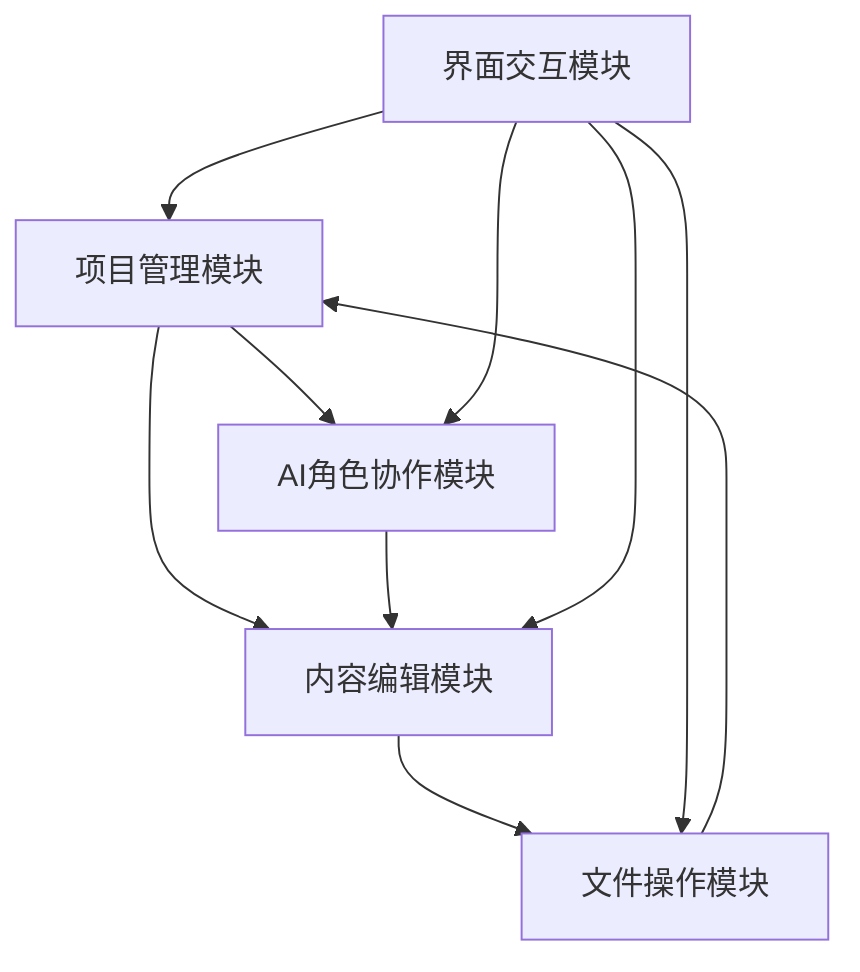
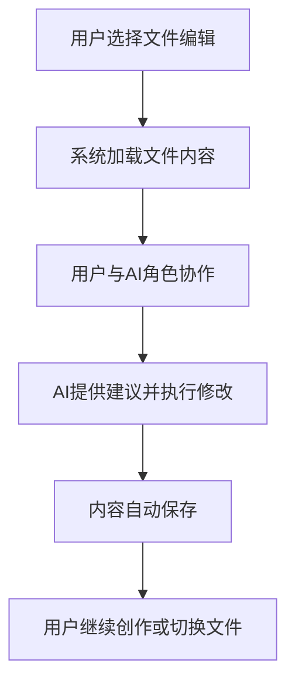
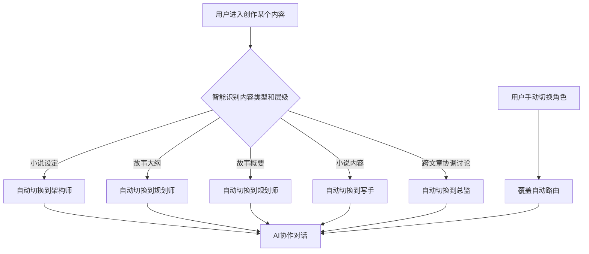
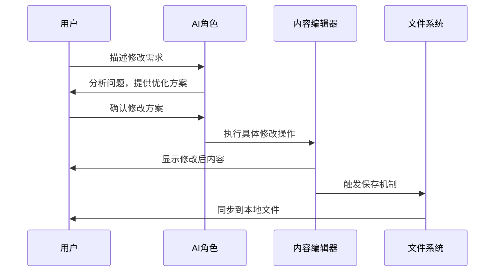

# PRD - 小说创作工具产品需求文档

## 一、产品定义层（What）

### 1.1 产品愿景与定位
**产品愿景**：打造首个AI角色驱动的智能引导小说创作平台，让每个有故事想法的人都能创作出优质小说。

**产品定位**：面向AI赋能写作需求的本地化小说创作工具
- **不是**：纯内容生成工具或传统写作软件
- **而是**：AI角色协作驱动的智能引导创作工作流平台

### 1.2 核心价值主张
**独特价值**："4角色AI协作 + 本地化安全 + 智能引导流程"

- **AI角色协作**：总监、架构师、规划师、写手四角色专业分工
- **本地化安全**：无数据库依赖，用户完全掌控作品数据
- **智能引导流程**：基于智能依赖识别的创作引导配合依赖检查确保作品质量

### 1.3 与竞品的差异化
| 对比项 | 传统工具 | AI工具 | 本产品 |
|--------|----------|--------|--------|
| AI协作 | 无 | 单一生成 | 4角色专业分工 |
| 数据安全 | 本地存储 | 云端存储 | 本地存储 |
| 创作流程 | 自由组织 | 缺乏结构 | 智能引导流程 |
| 学习成本 | 高 | 中 | 低(AI引导) |

## 二、用户需求层（Who）

### 2.1 目标用户画像
**核心用户**：对AI感兴趣，渴望用AI赋能写作的作者

**用户特征**：
- **技术敏感度**：对新技术有好奇心，愿意尝试AI工具
- **创作经验**：有一定写作基础，但缺乏系统的创作方法论
- **效率追求**：希望通过AI提升创作效率和质量
- **数据安全意识**：重视作品版权和数据安全

### 2.2 用户需求与痛点
**核心需求**：
1. **结构化创作指导**：不知道如何系统性地构建小说
2. **AI专业协作**：需要不同维度的专业建议和协助
3. **本地化安全**：完全掌控自己的创作数据
4. **简化操作流程**：降低技术门槛，专注创作本身

**关键痛点**：
- 传统写作软件功能复杂，学习成本高
- AI写作工具缺乏专业分工，建议单一
- 云端工具数据安全担忧
- 缺乏系统化的创作流程指导

### 2.3 使用场景分析
**主要使用场景**：
- **新手作者**：第一次写长篇小说，需要全流程指导
- **有经验作者**：希望AI协助提升创作效率和质量
- **业余创作者**：利用碎片时间进行创作，需要随时保存和同步

## 三、功能实现层（How）

### 3.1 核心功能架构

#### 整体架构设计
基于"左侧交互区 + 右侧内容区"的双栏架构，实现AI驱动的结构化创作流程。

#### 5大核心功能模块

**1. 项目管理模块**
- **本地项目导入**：支持空目录自动创建结构，现有目录规范校验
- **智能依赖流程**：小说设定（全局）→ 故事大纲（智能识别粒度）→ 文章概要 → 文章内容
- **依赖状态管理**：智能识别依赖层级，建议按依赖顺序创作，允许在满足前置依赖时自由创作，支持向前回溯修改
- **目录结构映射**：本地文件系统与网页展示的智能映射

**2. AI角色协作模块**
- **4角色系统**：总监（统筹质量）、架构师（世界观构建）、规划师（情节设计）、写手（文本创作）
- **智能角色路由**：根据用户当前操作内容自动切换合适角色
- **角色切换控制**：底部按钮支持用户手动切换角色
- **对话驱动修改**：AI不仅提供建议，确认后直接执行内容修改

**3. 内容编辑模块**
- **分类内容展示**：根据项目选项卡选择，只显示对应类型文件（设定/大纲/概要/内容）
- **实时编辑器**：右侧面板提供富文本编辑功能

**4. 文件操作模块**
- **目录规范检查**：导入时检查目录结构，不符合时弹窗提示用户调整
- **双重保存机制**：用户手动保存 + 30秒自动保存
- **本地同步**：所有修改实时同步到用户本地文件

**5. 界面交互模块**
- **Apple Style设计**：清晰、内容优先、简洁的视觉风格
- **响应式布局**：适配不同屏幕尺寸，摆脱固定宽度限制
- **更大字体**：确保内容清晰可读，降低视觉疲劳
- **减少信息过载**：遵循奥卡姆剃刀原则，界面简洁专注
- **简化交互设计**：降低用户认知负担，复杂流程封装


#### 模块协作流程



**协作逻辑**：用户选择创作内容 → 系统智能识别依赖层级并路由AI角色 → 用户与AI协作优化内容 → 内容编辑器提供实时编辑 → 文件操作模块安全保存到本地

### 3.2 业务流程设计

#### 核心业务流程

**1. 简化项目导入流程**
```mermaid
flowchart TD
    A[用户点击"选择项目目录"按钮] --> B{目录是否为空?}
    B -->|是| C[系统自动创建标准4目录结构<br/>0-小说设定/1-故事大纲/2-故事概要/3-小说内容]
    B -->|否| D[严格目录名称验证<br/>查找精确匹配4个标准目录]
    D --> E{验证结果}
    E -->|完全匹配| F[导入成功，立即进入工作界面]
    E -->|不匹配| G[清晰提示标准目录格式要求]
    G --> H[用户按要求创建目录]
    H --> A
    C --> F
    F --> J[显示简洁的项目工作界面]
```

**2. 简化创作协作流程**


**3. 自由探索创作流程**
用户自由选择任意文章的任意类型内容，系统智能路由AI角色：小说设定→架构师 | 故事大纲/概要→规划师 | 小说内容→写手 | 跨类型协调→总监

#### 业务规则集中说明

**依赖后置机制**：
- **智能依赖识别**：小说设定（全局）→ 故事大纲（智能识别文章级或章节级）→ 第N篇文章的概要 → 第N篇文章的内容
- **角色路由依赖**：规划师处理第N篇文章概要时需要小说设定+对应大纲存在，写手处理第N篇文章时需要该文章概要存在
- **有内容即可原则**：各层级不需完备，有基础内容即可推进下一步
- **智能检测提示**：缺少前置依赖时温和提示，允许用户选择继续创作（标记为草稿状态）

**AI角色路由机制**：
小说设定→架构师 | 故事大纲/概要→规划师 | 小说内容→写手 | 跨类型协调→总监

**简洁文件系统**：
- 单文件编辑：一次专注编辑一个文件，避免信息过载
- 清晰导航：通过左侧项目树进行文件切换

**双重保存**：30秒自动保存 + 手动保存，单向覆盖本地文件

#### 异常处理机制

**目录结构智能识别**：
- **标准4目录要求**：系统必须精确匹配4个标准目录名称：`0-小说设定`、`1-故事大纲`、`2-故事概要`、`3-小说内容`
- **严格格式验证**：只接受标准目录名称，不支持模糊匹配或关键词识别
- **明确用户指导**：提供清晰的目录创建指导和示例
- **其他目录自然展示**：4个核心目录外的其他目录不做限制，有什么展示什么
- **空目录自动创建**：系统自动创建标准格式的4目录结构（安全操作）
- **缺失目录处理**：展示标准格式示例，提示用户手动创建缺失目录后重新导入

**文件保存失败**：显示具体报错信息，用户点击保存按钮重试
### 3.3 AI交互规则

#### AI角色体系设计

**4角色专业分工**：
| 角色 | 职责定位 | 触发场景 | 对话特点 |
|------|----------|----------|----------|
| 总监 | 统筹全局、质量把控、跨文章协调 | 全局建议、文章衔接、质量评估 | 宏观视角，注重逻辑性和完整性 |
| 架构师 | 世界观构建、设定体系化 | 各文章设定内容主协作、世界观讨论 | 专业深度，体系化和逻辑自洽 |
| 规划师 | 故事结构设计、情节安排 | 各文章大纲/概要内容主协作、情节优化 | 结构化思维，逻辑性和可读性 |
| 写手 | 文本创作、语言表达 | 各文章内容创作主协作、文本润色 | 文学性强，注重表达和感染力 |

#### AI角色路由机制

**智能路由逻辑**：


**手动切换机制**：左侧对话窗口底部4个角色切换按钮，当前激活角色高亮显示，用户可随时手动切换

#### 对话驱动修改机制

**核心原则**：AI不仅提供建议，确认后直接执行内容修改

**标准对话流程**：


**交互机制**：
- **方案预览**：AI提供详细修改说明，用户预览效果
- **分步确认**：复杂修改分解为多个步骤，逐步确认执行
- **撤销支持**：修改后用户可要求撤销，AI执行反向操作

#### AI对话交互规范

**界面设计**：类似微信聊天界面，显示当前激活角色名称，支持连续对话和上下文记忆

**内容规范**：
- **专业性**：每个角色保持专业领域的深度和准确性
- **可操作性**：提供具体可执行的修改建议
- **用户导向**：以用户创作意图为导向，而非展示AI能力

**特殊情况**：依赖缺失时温和建议补充，超出角色能力时建议切换角色，发现问题时主动提醒

## 四、创作流程细化（How Details）

### 4.1 小说设定阶段流程

#### 阶段定位与触发
- **触发条件**：用户激活架构师角色或打开小说设定页面
- **核心目标**：构建完整的三维度小说世界观设定
- **输出产物**：故事世界.md + 故事主题.md + 故事角色.md

#### 技术实现说明

**设计创新**：
- **三维度MECE架构**：World(What) + Theme(Why) + Character(Who) 完整覆盖小说设定要素
- **5步引导流程**：AI角色的行为模式，通过提示词工程实现
- **智能归类能力**：利用AI天然的语言理解能力，无需复杂算法

**实际开发需求**：
- 3个预定义Markdown模板文件
- 架构师角色提示词（包含5步工作方法指导）
- 基础AI对话接口调用
- 简单的文件读写功能

**开发复杂度**：极低 - 主要工作是提示词设计，无需复杂系统开发

#### 智能引导式交互流程

**重要说明**：以下流程是AI角色的行为指导，通过提示词实现，非代码逻辑

**第一步：开放式引导收集**
- 宽泛友好的引导问题："我们对这个故事/主角/世界有什么想法？"
- 用户自由表达，不限制格式和逻辑
- 架构师耐心收集所有创意信息

**第二步：智能整理归类**
- 将用户想法按三维度归类：故事世界（What）、故事主题（Why）、故事角色（Who）
- 对照模板预设字段进行结构化整理
- 识别用户已提及和未提及的关键要素

**第三步：主动补充建议**
- 针对用户未提及的重要设定要素，主动提供合理建议
- 示例："基于您的设定，我建议主角年龄为XX岁，这样更符合故事背景"
- 补充建议基于已有信息的逻辑推理

**第四步：整体展示确认**
- 将完整的结构化设定展示给用户
- 整体确认而非逐项确认："您看这样的设定是否符合您的想法？"
- 支持用户修改和调整任何部分

**第五步：模板完善验收**
- 确保三个模板文件所有预设字段都有具体内容
- 检查设定间的逻辑一致性和相互支撑
- 完成后向用户确认并保存到本地文件

#### 核心交互原则
- **用户友好**：像创意讨论而非问卷调查
- **专业引导**：架构师主动发挥专业补充能力
- **奥卡姆剃刀**：一次处理一个维度，避免信息过载
- **智能适配**：根据用户水平调整提问深度和建议详细程度
- **智能归类**：用户随机表达的信息按MECE原则自动归类到对应文件

#### 标准模板规范

**故事世界.md模板**
```markdown
# 故事世界

## 时空框架
- **时间设定**：[具体时间跨度和历史背景]
- **空间设定**：[主要活动地点和地理环境]
- **时代特征**：[每个时期的社会文化特点]

## 世界规则
- **核心设定**：[1-2个关键的世界特殊规则]
- **运行机制**：[这些规则如何影响故事发展]
- **边界限制**：[规则的作用范围和限制]

## 环境氛围
- **典型场景**：[重要场所的具体描述]
- **时代质感**：[不同时期的环境氛围]
- **文化背景**：[影响角色的文化环境]
```

**故事主题.md模板**
```markdown
# 故事主题

## 作品定位
- **小说名称**：[作品标题]
- **故事类型**：[体裁和类型定位]
- **叙事结构**：[章节安排和特殊结构]
- **创作理念**：[指导整部作品的核心原则]

## 核心价值观
- **主题内核**：[一句话概括的故事主旨]
- **价值体系**：[支撑故事的核心价值观念]
- **时代意义**：[主题的现实意义和启发价值]

## 价值冲突
- **主要冲突**：[推动故事的核心价值观冲突]
- **选择考验**：[角色面临的关键价值选择]
- **成长主线**：[价值观在故事中的发展轨迹]

## 文化传承
- **传统元素**：[故事中的传统文化符号]
- **现代表达**：[传统文化的现代化阐释]
- **精神内核**：[要传递的民族精神和文化品格]
```

**故事角色.md模板**
```markdown
# 故事角色

## 主角设定
- **基本信息**：[姓名、年龄、身份、背景]
- **性格特质**：[核心性格特征和行为模式]
- **内在冲突**：[驱动角色发展的核心矛盾]
- **成长轨迹**：[从起点到终点的发展路径]

## 重要配角
### [配角姓名]
- **角色定位**：[在故事中的功能作用]
- **基本信息**：[简要背景信息]
- **关系设定**：[与主角的关系]

## 人物关系
- **核心关系**：[推动情节的关键人物关系]
- **关系演进**：[重要关系的发展变化]
- **冲突设计**：[人物间的主要矛盾和张力]
```

#### 模板执行要求

**技术实现方式**：通过架构师角色提示词约束，AI自动遵循

- **强制遵循**：架构师产出必须严格按照上述模板格式，不得偏离
- **字段完整**：所有预设字段必须填写完毕，不允许遗漏
- **格式统一**：markdown格式、层级结构、字段命名完全一致
- **内容质量**：每个字段内容具体明确，避免空泛表述

**开发实现**：
- 将模板格式和执行要求写入架构师角色的系统提示词
- AI会自动按照提示词中的格式要求生成内容
- 系统只需提供简单的文件保存功能

### 4.2 故事大纲阶段流程

#### 阶段定位与触发
- **触发条件**：用户激活规划师角色或打开故事大纲页面
- **核心目标**：构建故事的整体框架和核心价值立意
- **输出产物**：各篇章的故事大纲文件（四要素结构）

#### 技术实现说明

**设计理念**：
- **4步创作流程**：规划师AI角色的工作方法，通过提示词工程实现
- **四要素大纲模板**：结构化的信息架构设计，AI天然理解
- **对话式调整**：用户与AI自然对话来优化大纲内容

**实际开发需求**：
- 1个四要素大纲Markdown模板文件
- 规划师角色提示词（包含4步工作方法指导）
- 基础AI对话接口调用
- 简单的文件读写功能

**开发复杂度**：极低 - 主要工作是提示词设计，无需复杂系统开发

#### 工作流程

**重要说明**：以下流程是AI角色的行为指导，通过提示词实现，非代码逻辑
1. **主题深度分析**：研究故事核心主题和精神内核
2. **背景事件匹配**：选择合适的时代背景和历史环境  
3. **核心事件设计**：构建体现主题的核心情节冲突
4. **价值意义提炼**：明确故事要传达的核心价值

#### 故事大纲通用模板
```markdown
### 第N篇：[篇章标题]

**1. 背景设定**
[时代环境]，[重要事件/社会背景]，[时代特征和影响范围]。

**2. 主题立意**
[核心价值观/哲学内涵]。选择[背景设定]诠释[核心理念]，体现[主题与背景的关联]，强调[时代精神/普世价值]。

**3. 核心事件**
[主角面临的核心矛盾]，[运用智慧/成长的关键行动]，最终[结局和人物成长]。

**4. 价值意义**
[对个人的影响/成长意义]，[对社会/他人的价值]。
```

#### 模板使用说明

**技术实现方式**：通过规划师角色提示词约束，AI自动遵循

**开发实现**：
- 将四要素模板格式和要求写入规划师角色的系统提示词
- AI会自动按照提示词中的四要素模板格式生成大纲内容
- 用户通过对话与AI互动调整大纲，AI根据用户反馈修改内容
- 系统只需提供简单的文件保存功能

### 4.3 故事概要阶段流程

#### 阶段定位与触发  
- **触发条件**：故事大纲完成，用户需要详细情节设计
- **核心目标**：将大纲扩展为详细的故事骨架框架
- **输出产物**：完整的故事概要（含6步逻辑结构）

#### 工作流程
**核心6步逻辑骨架**（不可改变）：
```
起始状态→矛盾发生→冲突升级→智慧介入→问题解决→结果状态
```

#### 故事概要通用模板
```markdown
### 第N篇：[篇章标题]

#### 基本信息
- **时代背景**：[具体年代/历史背景及其影响]
- **主要人物**：[本篇出场人物，标注主次关系]  
- **核心矛盾**：[主角面临的主要挑战或机遇]

#### 情节发展脉络
- **起始状态**：[何人+何时+何地+何事] → [为什么会这样？]
- **矛盾发生**：[何人+何时+何地+何事] → [对抗的根源是什么？]
- **冲突升级**：[何人+何时+何地+何事] → [为什么矛盾加剧？]
- **智慧介入**：[何人+何时+何地+何事] → [主角如何运用智慧？]
- **问题解决**：[何人+何时+何地+何事] → [为什么这样做有效？]
- **结果状态**：[何人+何时+何地+何事] → [这个结果如何引导下一篇？]

#### 关键要素
- **核心场景**：[故事发生的具体地点和重要场景]
- **人物成长**：[主角在本篇中的智慧、品格具体成长]
- **主题体现**：[本篇通过什么具体行为体现核心价值观]
- **悬念设置**：[为后续情节埋下的伏笔线索]

#### 衔接控制
- **承接前篇**：[从上一篇继承哪些人物状态、情节线索]
- **传递后篇**：[给下一篇留下什么状况，哪些线索延续]

#### 写作约束（重要）
**骨架不可改变**：
1. 6步发展脉络的逻辑顺序必须严格遵守
2. 核心场景设定不得随意更换
3. 人物成长轨迹按规划执行
4. 主题价值观表达方式不可偏离

**允许填充血肉**：
1. 对话内容的丰富和润色  
2. 环境、心理、动作等细节描写
3. 文学手法和表达技巧的运用
4. 情感表达的深化和细腻化
```

#### 质量检查标准
1. **依赖性检查**：确保与故事大纲和世界观设定完全一致
2. **逻辑完整性**：6步逻辑链条完整，因果关系清晰
3. **可执行性**：概要详细程度足以指导写手创作

### 4.4 小说内容阶段流程

#### 阶段定位与触发
- **触发条件**：用户激活写手角色或故事概要已完成
- **核心目标**：将故事骨架转化为完整的文学作品
- **输出产物**：高品质小说内容文件

#### 工作流程

**第一步：创作准备**
- 深度理解故事大纲和对应概要的核心要求
- 阅读前3篇内容，确保情节和人物状态连贯
- 明确本篇的核心冲突、关键场景和主题体现

**第二步：结构化创作**
基于概要的6步逻辑结构创作，严格按重要程度分配篇幅：
- **起始状态+结果状态**（简化30%）：背景展现和悬念设置
- **矛盾发生+问题解决**（标准30%）：情节推进和方案实施  
- **冲突升级+智慧介入**（重点40%）：核心戏剧冲突和人物成长

**第三步：品质自检**
- 依赖一致性：与大纲概要完全吻合
- 内容连贯性：前后文衔接自然流畅
- 主题融入性：自然体现核心价值观
- 文学品质：语言流畅、情感真实

#### 修订工作规范
- **深度分析**：全面理解依赖文件，识别不一致之处
- **价值判断**：保留有助情节和人物塑造的内容，删除冗余部分
- **精确执行**：严格按用户要求修改，不得擅自删除其他内容

#### 核心约束与边界
- **不可改变**：6步逻辑结构、核心场景、人物成长轨迹、主题表达方式
- **允许优化**：对话内容、细节描写、文学手法运用、情感表达深化
- **格式要求**：只输出纯小说内容，无任何工作标注或元信息
- **职责边界**：专注文学创作，发现设定冲突立即报告，不自行处理

## 五、界面体验层（Where）

### 4.1 界面布局设计

#### 整体布局架构
**Apple Style响应式设计**：左侧交互区(响应式) + 右侧内容区(自适应)

```
┌─────────────────┬───────────────────────────────┐
│   左侧交互区    │        右侧内容区              │
├─────────────────┼───────────────────────────────┤
│  [对话] [项目]  │      当前编辑文件Tab           │
│                 │    ┌─────────────────────────┐  │
│ ┌─────────────┐ │    │ 文件名.md            × │  │
│ │AI角色对话区 │ │    └─────────────────────────┘  │
│ │+ 角色切换   │ │                               │
│ └─────────────┘ │         文档编辑区域            │
│      或         │        （简洁专注内容）         │
│ ┌─────────────┐ │                               │
│ │项目导航树   │ │                               │
│ └─────────────┘ │                               │
└─────────────────┴───────────────────────────────┘
```

#### 界面区域详细设计

**左侧交互区**：
- **选项卡切换**：对话(AI角色对话+角色切换按钮) | 项目(4类型导航+文件列表)
- **对话界面**：清晰的消息滚动区域 + 简洁输入框

**右侧内容区**：
- **单文件编辑**：当前打开文件的简洁编辑环境
- **内容优先**：去除复杂界面元素，专注内容创作

**编辑功能**：清晰的Markdown编辑 + 必要的文件保存状态指示

### 4.2 交互行为规范

#### 交互流程说明

**项目导入交互**：
```mermaid
flowchart TD
    A[显示导入按钮+目录规范示例文字] --> B[用户点击导入项目]
    B --> C[系统文件选择器]
    C --> D[选择本地目录]
    D --> E{空目录检查}
    E -->|空目录| F[系统自动创建标准4目录结构]
    E -->|有内容| G[严格目录名称验证<br/>查找"0-小说设定""1-故事大纲""2-故事概要""3-小说内容"]
    G --> H{识别完整度}
    H -->|4个目录全部匹配| I[导入成功，加载项目到左侧项目树<br/>其他目录自然展示]
    H -->|目录缺失或名称不匹配| J[显示标准格式对话框<br/>提示：请使用标准目录名称]
    J --> K[用户查看示例，手动创建目录]
    K --> L[用户重新点击导入]
    L --> C
    F --> I
    I --> M[右侧显示欢迎页面]
```

#### 界面文字规范

**导入按钮区域文字示例**：
```
┌─────────────────────────────────────┐
│        选择项目目录开始创作          │
├─────────────────────────────────────┤
│ 📁 请确保目录包含以下4个文件夹：     │
│                                     │
│ • 0-小说设定 （标准目录名称）        │
│ • 1-故事大纲 （标准目录名称）        │
│ • 2-故事概要 （标准目录名称）        │
│ • 3-小说内容 （标准目录名称）        │
│                                     │
│ 空目录将自动创建标准结构             │
└─────────────────────────────────────┘
```

**缺失目录提示对话框文字**：
```
目录识别结果

✅ 已识别：[显示找到的目录]
❌ 缺失：[显示缺失的目录类型]

请按以下格式手动创建缺失目录：
• 0-小说设定
• 1-故事大纲  
• 2-故事概要
• 3-小说内容

创建完成后请重新选择目录导入。
```

**文件操作流程**：
1. 用户在左侧项目树点击文件
2. 右侧自动创建新Tab并加载内容
3. 内层Tab根据智能识别的依赖链条自动加载前置依赖内容
4. 用户如需AI协作，切换到对话选项卡，系统智能路由对应角色

**AI对话交互流程**：
1. 用户输入对话内容
2. 系统识别当前上下文，确保角色正确
3. AI角色回复，如需修改则提供具体方案
4. 用户确认后，系统执行修改并更新右侧内容
5. 自动触发文件保存机制

